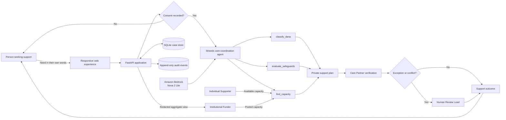

# Paraspara

**Dignity-first, AI-orchestrated community support.**

Paraspara is a multilingual Good Neighbor Agent that turns a person's stated need into a consent-controlled support plan, finds appropriate community capacity, pauses for human judgment when risk or ambiguity appears, and produces privacy-preserving evidence of outcomes.

The project is inspired by the Jain principle *parasparopagraho jīvānām*—living beings support one another—and applies practical safeguards drawn from ahiṃsā, satya, aparigraha, asteya, and anekāntavāda.

## Hackathon track

**Agents for Humans — Good Neighbor Agents**

Paraspara is designed for nonprofits, community organisations, volunteers, individual supporters, people seeking support, and institutional funders.

## The problem

Community support is rarely blocked by a total absence of goodwill. It is blocked by fragmented requests, repeated coordination, privacy risks, uncertain capacity, manual follow-ups, and difficult decisions buried inside routine work.

Conventional donation platforms optimise discovery and payment. Paraspara coordinates the work between a need and a verified outcome while keeping the person receiving support in control.

## What Paraspara does

1. Accepts a need in English, Hindi, or Gujarati.
2. Uses a Strands agent to interpret the request without deciding deservingness.
3. Classifies the relevant form of *dāna*.
4. Evaluates dignity, consent, safety, truthfulness, and non-control safeguards.
5. Searches verified support capacity through agent tools.
6. Prepares a private plan for the person to approve or revise.
7. Gives each participant only the information required for their responsibility.
8. Records agent and human actions in an audit trail.
9. Escalates exceptions for accountable human judgment.
10. Produces anonymous programme evidence for institutional funders.

## Why an agent is necessary

This is not a chatbot layered over a donation form. The agent coordinates repetitive, cross-role work: interpreting requests, checking safeguards, comparing capacity, exposing uncertainty, redacting persona views, and preparing the next safe action. People retain authority over consent, ground truth, ethical exceptions, and outcomes.

The current Strands tools are:

- `classify_dana` — classifies the support type without judging worthiness.
- `evaluate_safeguards` — identifies relevant ethical and safety constraints.
- `find_capacity` — searches verified demo capacity without returning recipient identity.

Live agent responses include a tool-use trace so the contribution of Strands is inspectable.

## Architecture



See [docs/architecture.md](docs/architecture.md) for the detailed trust-boundary view.

## Personas and authority

| Participant | Can do | Cannot do |
| --- | --- | --- |
| Person seeking support | State the need, set boundaries, approve or revise, confirm outcome | Be forced to publish a story or accept a match |
| Individual supporter | Offer time, transport, skills, or funds | Select or contact a private recipient directly |
| Care Partner | Confirm consent, feasibility, safety, and delivery facts | Collect unrelated personal information |
| Human Review Lead | Resolve genuine exceptions with accountable judgment | Delegate an ethical exception silently to the model |
| Institutional Funder | Sustain verified programme capacity | Access personal requests or choose individual recipients |

## Technology

- Strands Agents SDK
- Amazon Bedrock with the Global Amazon Nova 2 Lite inference profile
- FastAPI and Uvicorn
- SQLite
- Semantic HTML, CSS, and vanilla JavaScript
- English, Hindi, and Gujarati interfaces

## Prerequisites

- Python 3.10 or newer
- An AWS account for live Strands mode
- AWS credentials configured locally with permission to invoke Amazon Bedrock
- Access to the `global.amazon.nova-2-lite-v1:0` inference profile, or another compatible Bedrock model

Do not place AWS credentials in this repository or expose them in browser JavaScript.

## Quick start — Windows PowerShell

Clone or download the public repository. From the repository root, run:

```powershell
py -m venv .venv
.\.venv\Scripts\python.exe -m pip install -r requirements.txt

# Uses live Strands mode by default when AWS credentials are available.
.\run-backend.ps1
```

Open <http://127.0.0.1:8765/>. Interactive API documentation is available at <http://127.0.0.1:8765/docs>.

## Quick start — macOS or Linux

Clone or download the public repository. From the repository root, run:

```bash
python3 -m venv .venv
source .venv/bin/activate
pip install -r requirements.txt

export PARASPARA_AI_MODE=strands
export PARASPARA_MODEL_ID=global.amazon.nova-2-lite-v1:0
export AWS_REGION=us-east-1
python -m uvicorn backend.app:app --host 127.0.0.1 --port 8765
```

## Safe local mode

The deterministic local mode exercises the application and privacy flow without calling a model provider:

```powershell
$env:PARASPARA_AI_MODE="local"
.\run-backend.ps1
```

Local mode must be identified as a fallback in demonstrations; it must not be represented as live Strands reasoning.

## Configuration

| Variable | Default | Purpose |
| --- | --- | --- |
| `PARASPARA_AI_MODE` | `strands` in `run-backend.ps1` | Selects live Strands or deterministic local mode |
| `PARASPARA_MODEL_ID` | `global.amazon.nova-2-lite-v1:0` | Bedrock inference profile used by Strands |
| `AWS_REGION` | `us-east-1` | Bedrock region |
| `PARASPARA_DB` | `data/paraspara.db` | SQLite database path |

See [.env.example](.env.example). The application does not require a committed `.env` file.

## API endpoints

| Method | Endpoint | Purpose |
| --- | --- | --- |
| `GET` | `/api/health` | Backend and AI-mode status |
| `POST` | `/api/cases` | Create and interpret a private case |
| `GET` | `/api/cases/{id}?persona=...` | Retrieve a persona-specific, redacted case view |
| `POST` | `/api/cases/{id}/consent` | Approve or request revision of the plan |
| `POST` | `/api/cases/{id}/actions` | Record a participant action and advance state |
| `GET` | `/api/cases/{id}/audit` | Read the case audit history |

## Suggested judge walkthrough

1. Open the journey and explain the three streams: person, capacity, and trust.
2. Choose **Person seeking support**.
3. Enter an explicitly synthetic request.
4. Show the live Strands result and its tool-use trace.
5. Approve the private plan.
6. Switch participant views and show that information changes by responsibility.
7. Open the funder view and demonstrate that personal information is withheld.
8. Show the audit endpoint or interface to distinguish agent actions from human decisions.

## Privacy and safety

This hackathon build uses synthetic demonstration data. Do not enter real patient information, government identifiers, financial information, precise addresses, or other sensitive personal data.

The prototype demonstrates consent gating and field-level redaction, but it is not a production healthcare system. Production use would require authentication, role-based authorisation, encryption, retention controls, threat modelling, jurisdiction-specific privacy review, operational policies, and qualified human oversight.

The agent is explicitly prohibited from:

- Deciding who deserves support
- Inventing or silently confirming facts
- Overriding consent
- Exposing identity to supporters or funders
- Measuring spiritual merit
- Resolving ethical exceptions without human judgment

## Repository structure

```text
backend/
  app.py                 FastAPI routes, persistence, redacted views, audit events
  agent_service.py       Strands agent, tools, output validation, local fallback
dist/
  index.html             Responsive application
  backend-client.js      Browser-to-API integration
  care-journey.*         Interactive journey experience
  persona-i18n.js        English, Hindi, and Gujarati content
docs/
  architecture.md        Detailed architecture diagram and trust boundaries
requirements.txt         Python dependencies
run-backend.ps1          Windows development launcher
.env.example             Non-secret configuration example
```

## Open-source and build disclosure

Paraspara was created for the Agents for Humans Hackathon. It uses the open-source dependencies listed in `requirements.txt`; those projects retain their respective licences. No third-party private data is bundled with the repository. All demonstration cases should remain synthetic.

## Licence

Released under the [MIT License](LICENSE).


