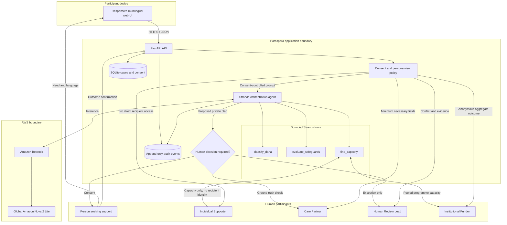
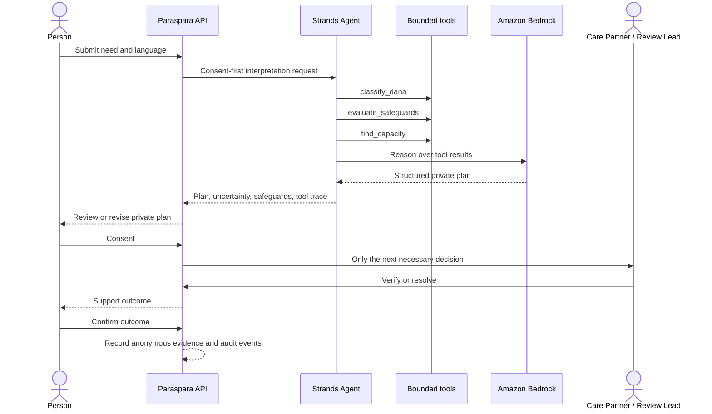

# Paraspara architecture

This diagram separates the human journey, agent orchestration, trust boundaries, persistence, and external model provider.

## Trust boundaries

1. **Participant device:** collects a synthetic demonstration request and displays only the selected participant's view.
2. **Application boundary:** enforces consent, redaction, case state, validation, and audit recording.
3. **AWS boundary:** receives the minimum prompt required for live inference. Real sensitive data must not be used in this hackathon build.
4. **Human authority:** consent, ground-truth verification, exceptions, and final outcome confirmation remain human decisions.

## Data minimisation by participant

| Participant | Information exposed |
| --- | --- |
| Person seeking support | Their own request, private plan, consent state, and outcome |
| Individual Supporter | Shareable constraints and required capacity; no recipient identity |
| Care Partner | Safe plan and minimum operational facts |
| Human Review Lead | Conflict, evidence, uncertainty, and available options |
| Institutional Funder | Support type, required capacity, and anonymous aggregate outcome |

## Agent execution

